## Insurance Fraud Detection Using Machine Learning

### 1. Introduction

Insurance fraud is a critical challenge for financial institutions, payment processors, and digital platforms that handle large volumes of monetary transactions. Fraudulent activities not only generate direct financial losses but also erode customer trust, increase operational costs, and require significant manual investigation effort. As digital transactions continue to grow in scale and complexity, traditional rule-based fraud detection systems struggle to adapt to evolving fraud patterns.

This project, **Insurance Fraud Detection Using Machine Learning**, aims to build a robust, data-driven pipeline that detects fraudulent transactions using supervised learning models. The project covers the complete lifecycle of a typical applied machine learning system:

- **Data loading and cleaning**
- **Exploratory Data Analysis (EDA)**
- **Feature engineering**
- **Preprocessing and handling class imbalance**
- **Model training and hyperparameter selection**
- **Model evaluation and comparison**
- **Explainability and interpretation of model predictions**

The codebase is organized into modular components for EDA, preprocessing, feature engineering, model training, and evaluation. The goal of this report is to document the design decisions, methodology, experiments, and results in a clear and reproducible way.

### 2. Problem Definition

#### 2.1 Business Problem

The main objective is to **identify fraudulent transactions** as accurately and early as possible. Each transaction is associated with structured attributes such as transaction amount, type, account balances before and after the transaction, and a binary fraud label indicating whether the transaction is fraudulent (`isFraud`).

From a business standpoint, an effective fraud detection system should:

- **Minimize false negatives** (fraudulent transactions predicted as non-fraud) because they lead directly to financial losses.
- **Control false positives** (legitimate transactions flagged as fraud) to avoid harming customer experience and overloading manual review teams.
- **Provide interpretable insights** into the drivers of fraud risk so that fraud analysts can understand and refine risk policies.

#### 2.2 Machine Learning Problem

Formally, the task is a **binary classification** problem:

- Input: feature vector \( x \in \mathbb{R}^d \) representing a transaction.
- Output: binary label \( y \in \{0, 1\} \), where 1 denotes a fraudulent transaction.

Given a dataset of historical transactions \(\{(x_i, y_i)\}_{i=1}^N\), the goal is to learn a function \( f(x) \approx P(y = 1 \mid x) \) that assigns a probability of fraud to each transaction. We then convert this probability into a binary decision using a threshold (often 0.5, but this can be tuned for business needs).

Because fraud is typically rare, the dataset is highly **imbalanced**, making metrics like **ROC AUC**, **Precision-Recall AUC (PR AUC)**, **F1-score**, and **recall** more informative than accuracy alone.

### 3. Dataset Description

#### 3.1 Source and Structure

The dataset is loaded via `utils.data_loader.load_raw_data` and follows the common structure used in transaction fraud detection benchmarks. At a high level, each row represents a single transaction with:

- Transaction identifier or temporal index (implicit)
- Transaction type (`type`, categorical)
- Monetary attributes such as `amount`
- Account balances before and after the transaction for origin and destination accounts
- The target label `isFraud` indicating whether the transaction is fraudulent

The core target and key columns used throughout the pipeline are:

- **`isFraud`**: binary target label (0 = non-fraud, 1 = fraud).
- **`type`**: transaction type (e.g., payment, cash-out, transfer).
- **Amount and balance columns**: such as `amount`, `oldbalanceOrg`, `newbalanceOrig`, `oldbalanceDest`, `newbalanceDest`, and other balance-related features.

The dataset exhibits the typical skew found in real-world fraud datasets: only a very small fraction of transactions are labeled as fraudulent.

#### 3.2 Target and Feature Columns

The preprocessing module `utils.preprocessing` defines the target column and key categorical column:

- `TARGET_COL = "isFraud"`
- `TRANSACTION_TYPE_COL = "type"`

During preprocessing:

- The **target variable** \( y \) is extracted from `df[TARGET_COL]`.
- The remaining columns form the feature matrix \( X \), which is then split into:
  - **Categorical features**: currently focused on the `type` column.
  - **Numerical features**: all other non-categorical columns.

This separation allows the project to apply appropriate transformations to each group (e.g., one-hot encoding for categorical features, scaling for numerical features).

#### 3.3 Class Imbalance

Fraud datasets are typically **heavily imbalanced**, with fraudulent transactions representing a small minority of all transactions. This imbalance presents several challenges:

- A naive classifier that predicts “non-fraud” for all transactions might achieve very high accuracy, but be useless in practice.
- Standard loss functions can bias the model toward the majority class unless corrections are applied.

To address this, the project uses **SMOTE (Synthetic Minority Over-sampling Technique)** within `utils.preprocessing.apply_smote` to rebalance the training data:

- SMOTE generates synthetic minority-class samples in feature space.
- It is applied **only on the training split**, preserving realistic distributions in validation and test sets.

In addition, several models use **class weighting** (e.g., `class_weight="balanced"` in Logistic Regression, Random Forest, and LightGBM) to give higher importance to minority-class examples.

### 4. Project Architecture

The project is organized into modular components that separate concerns and improve maintainability:

- `eda/` — Exploratory data analysis and visualization of the raw and enriched dataset.
- `features/` — Feature engineering logic, including the creation of domain-specific fraud-related features via `add_fraud_features`.
- `utils/` — Shared utilities such as data loading, preprocessing, metrics computation, and plotting.
- `models/` — Model training scripts and saved model artifacts.
- `evaluation/` — Model evaluation logic, generation of comparison plots, and model explainability plots (e.g., SHAP).

Key scripts:

- `eda/eda_main.py`: runs the complete EDA pipeline and saves plots and summary files under `eda/plots/`.
- `models/train_models.py`: trains multiple supervised learning models and saves them under `models/saved_models/`.
- `evaluation/evaluate_models.py`: loads trained models, evaluates them on the test set, and generates evaluation plots under `evaluation/plots/`.

This modular design makes it straightforward to rerun individual stages (EDA, training, evaluation) and to extend the project with new models or features.

### 5. Exploratory Data Analysis (EDA)

The EDA pipeline in `eda/eda_main.py` performs a comprehensive analysis of the dataset and saves multiple plots to `eda/plots/`. This section summarizes the main steps and links to the generated visualizations.

#### 5.1 Data Overview and Missing Values

The function `data_overview(df)` produces:

- A text summary file `eda/plots/data_info.txt` containing:
  - Dataset info (column data types, non-null counts).
  - Descriptive statistics for numerical and categorical features.
- A visualization of missingness:

`eda/plots/missing_values_heatmap.png`:

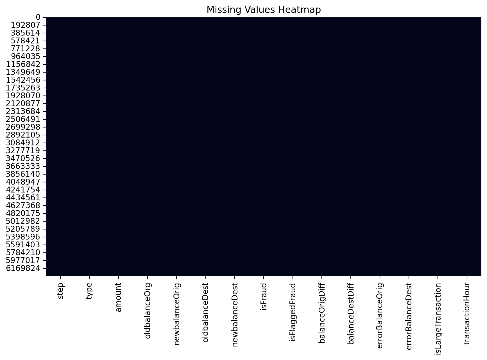

This heatmap reveals:

- Whether there are systematic patterns of missingness across rows or columns.
- Potential data quality issues (e.g., columns with many missing values).

If the dataset contains the target column `isFraud`, `data_overview` also generates a class distribution plot:

`eda/plots/fraud_distribution.png`:

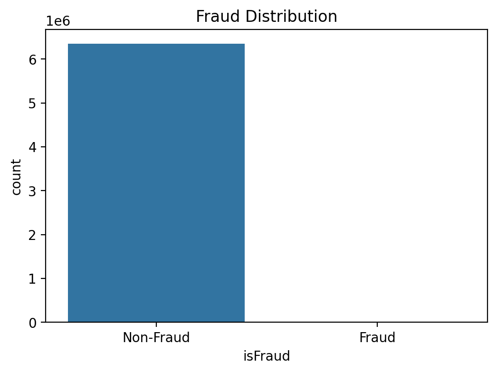

This bar chart illustrates the severe imbalance between fraudulent and non-fraudulent transactions, motivating the need for techniques like SMOTE and class weighting.

#### 5.2 Univariate Distributions

The `distributions(df)` function analyzes key numerical features.

For the transaction amount:

- `eda/plots/amount_histogram.png`:

  - Shows the raw distribution of transaction amounts.
  - Often reveals a heavy right tail, where most transactions are small and a few are very large.

- `eda/plots/log_amount_histogram.png`:

  - Plots \(\log(1 + \text{amount})\).
  - Reduces skew and makes it easier to compare differences in the mid-range of transaction values.

For balance-related columns (e.g., `oldbalanceOrg`, `newbalanceOrig`, `oldbalanceDest`, `newbalanceDest`), the function creates:

- `eda/plots/balance_distributions.png`:

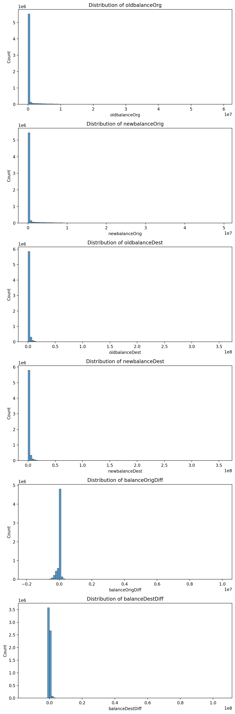

This figure stacks histograms of each balance column to:

- Visualize the distribution of account balances across transactions.
- Detect potential issues such as negative balances or unusually large values.

#### 5.3 Fraud vs. Transaction Type and Amount

The `fraud_analysis(df)` routine focuses specifically on how fraud relates to transaction types and key numeric attributes:

- `eda/plots/fraud_vs_transaction_type.png`:

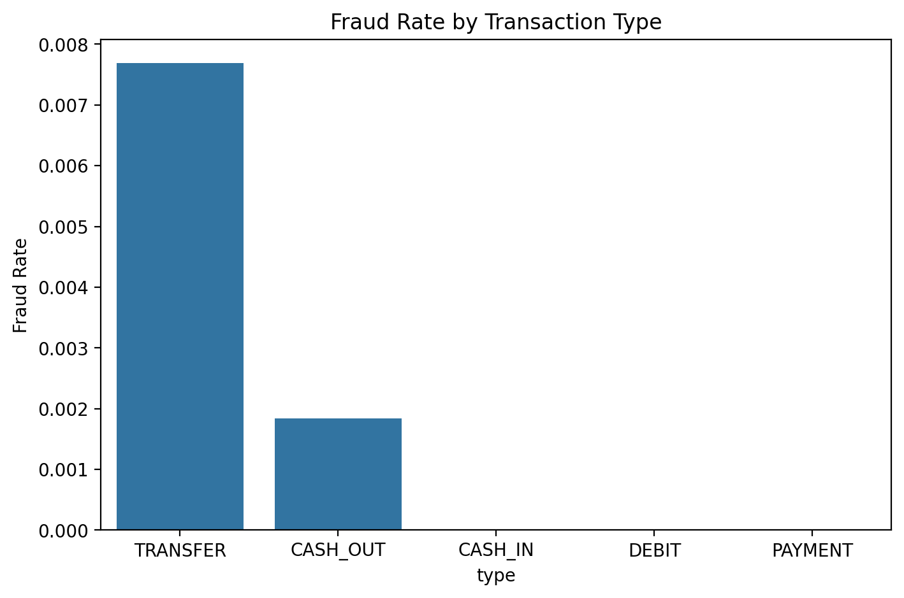

This bar plot shows the **fraud rate** by transaction type (mean of `isFraud` per `type`). It typically reveals:

- Certain transaction types (e.g., transfers or cash-outs) may have disproportionately high fraud rates.
- Others (e.g., cash-in or payments) may be relatively safe.

To analyze the relationship between fraud and transaction amounts, the script generates:

- `eda/plots/fraud_vs_amount_boxplot.png`:

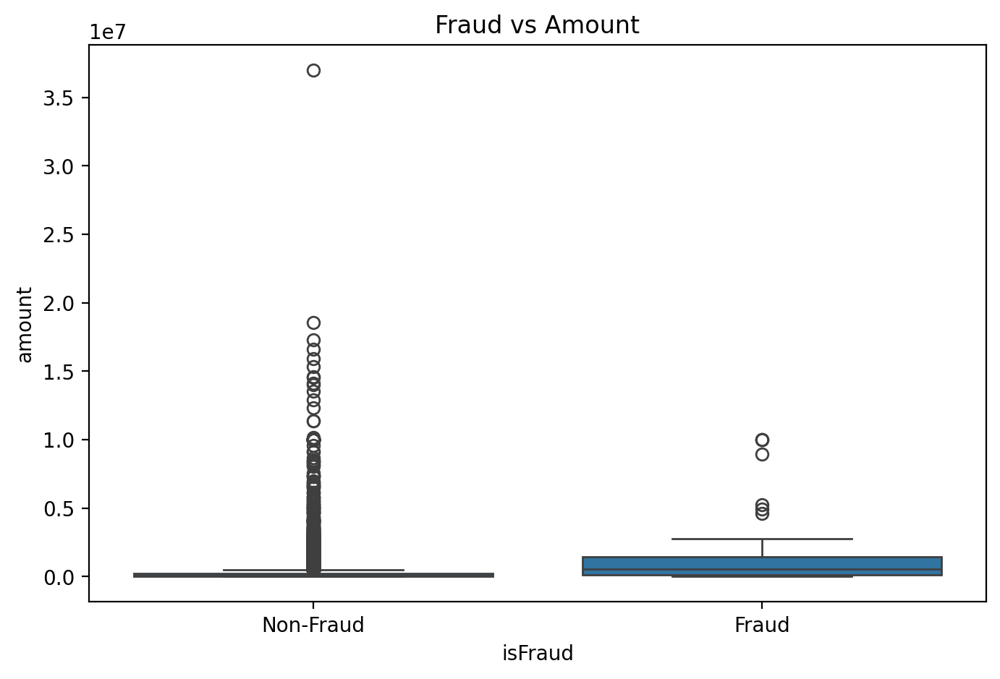

This boxplot compares the distribution of transaction amounts for fraud vs non-fraud transactions, typically based on a random sample (up to 50,000 rows) for performance reasons. It helps answer:

- Are fraudulent transactions typically higher amounts?
- Are there characteristic ranges where fraud is more prevalent?

For balance-related columns, `fraud_analysis` creates separate boxplots for each:

- Files like:
  - `eda/plots/fraud_vs_oldbalanceOrg_boxplot.png`
  - `eda/plots/fraud_vs_newbalanceOrig_boxplot.png`
  - `eda/plots/fraud_vs_oldbalanceDest_boxplot.png`
  - `eda/plots/fraud_vs_newbalanceDest_boxplot.png`

These plots highlight how origin and destination balances differ between fraud and non-fraud transactions, which may surface suspicious patterns such as zero balances or inconsistent balance updates.

#### 5.4 Correlation Analysis

The `correlation_analysis(df)` function computes the correlation matrix for all numeric features and saves:

- `eda/plots/correlation_heatmap.png`:

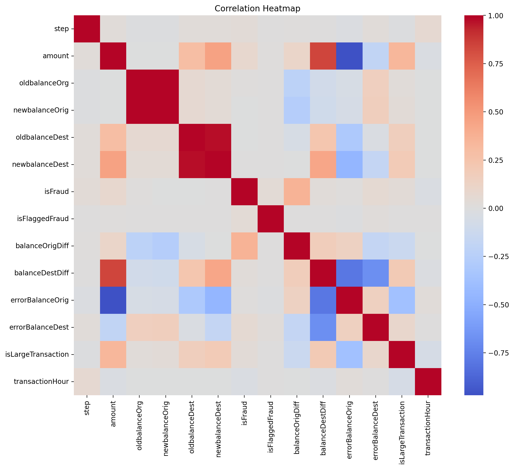

This heatmap helps identify:

- Strong positive or negative correlations between features.
- Potential multicollinearity issues (e.g., pairs of features that are almost perfectly correlated).
- Relationships between input variables and the target `isFraud` (if included in the matrix).

These insights inform feature engineering and model selection. Highly correlated features might be combined or one of them dropped; important correlated features may suggest new derived features.

#### 5.5 Outlier Detection

Outliers can distort model training and may represent either data quality issues or genuinely interesting but rare behaviors.

The `outlier_analysis(df)` function:

- Draws boxplots for up to four numerical features:

  - `eda/plots/outliers_boxplots.png`

- Computes approximate outlier counts using the Interquartile Range (IQR) rule and writes:

  - `eda/plots/iqr_outliers_summary.txt`

From these, we can:

- Identify features with heavy tails or extreme values.
- Decide whether to cap, transform, or retain extreme values based on domain knowledge.

#### 5.6 Feature Relationships and Pairwise Patterns

The `feature_relationships(df)` function explores interactions between key numeric features:

- It selects a subset of columns (if present): `["amount", "oldbalanceOrg", "newbalanceOrig", "oldbalanceDest", "newbalanceDest"]`.
- It optionally includes `isFraud` as a hue for coloring points by fraud label.

It then generates a Seaborn pairplot saved as:

- `eda/plots/feature_relationships_pairplot.png`:

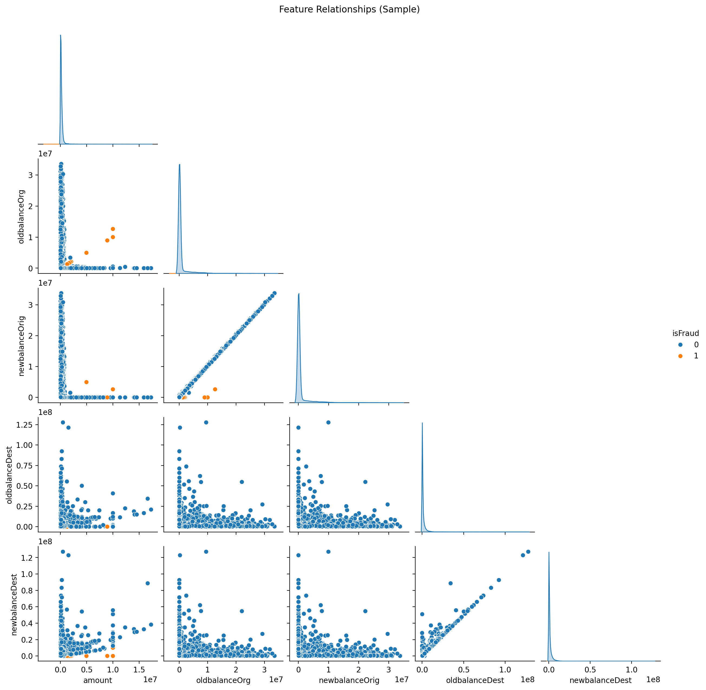

This plot helps visually inspect:

- How features co-vary and cluster together.
- Whether fraudulent transactions occupy specific regions of feature space.

#### 5.7 Clustering and Unsupervised Structure

To explore unsupervised structure in the data, `clustering_analysis(df)` applies:

- **Standard scaling** to numerical features (excluding `isFraud`).
- **K-Means clustering** with varying numbers of clusters \(k\).
- **PCA** to reduce dimensionality to 2D for visualization.

The following plots are generated:

- `eda/plots/kmeans_elbow.png`:

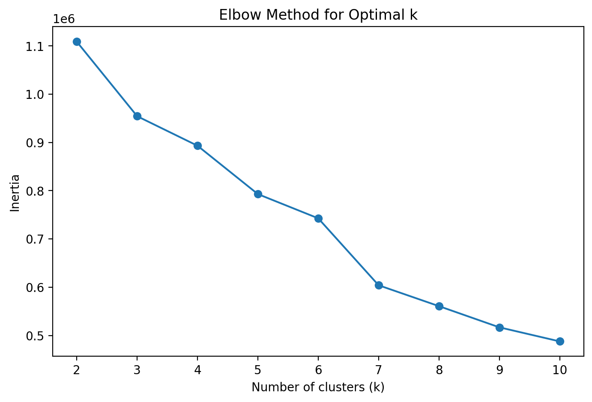

Shows the **elbow method** curve of inertia (within-cluster sum of squares) vs number of clusters \(k\). The “elbow” point provides a heuristic for a reasonable choice of \(k\).

- `eda/plots/kmeans_pca_clusters.png`:

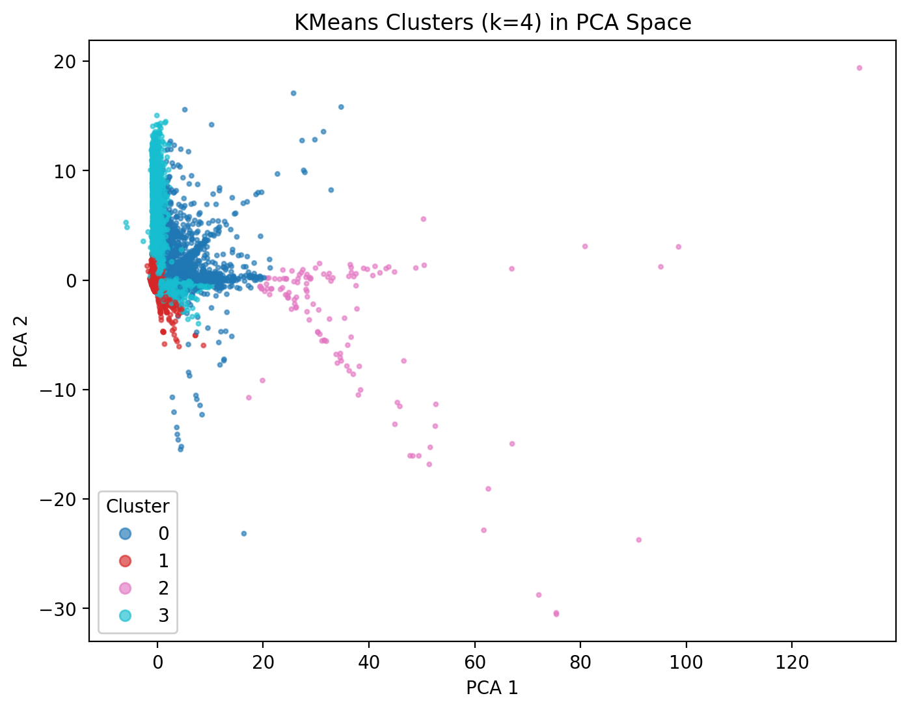

Shows the clusters in 2D PCA space, helping to:

- Visualize dense clusters of similar transactions.
- Inspect whether clusters align with fraudulent vs non-fraudulent behavior (when cross-checked with labels).

Overall, the EDA module builds a comprehensive understanding of the dataset, informs preprocessing and feature engineering decisions, and surfaces key risk factors and patterns.

### 6. Feature Engineering

Feature engineering is implemented in `features.feature_engineering.add_fraud_features`. While the full implementation is not reproduced here, the general objectives of feature engineering in this project are:

- Encode domain knowledge about how fraud manifests in transactional behavior.
- Improve model performance by creating more discriminative representations.
- Simplify patterns that are difficult to learn from raw features alone.

Typical examples of fraud-related engineered features include:

- **Balance deltas**: differences between pre- and post-transaction balances for origin and destination accounts.
- **Proportional changes**: normalized changes in balances relative to prior balances.
- **Flags for suspicious patterns**, such as:
  - Amounts exceeding certain thresholds.
  - Inconsistent balance updates (e.g., balances not changing after a transaction).
  - Transactions where origin or destination balances are zero or negative when they should not be.

These engineered features are added before preprocessing and model training, and they play an important role in improving recall and precision for fraudulent transactions.

### 7. Data Preprocessing and Handling Imbalance

The preprocessing logic is encapsulated in `utils.preprocessing`.

#### 7.1 ColumnTransformer Pipeline

The function `build_preprocessor(df)`:

1. Validates that the target column (`isFraud`) is present.
2. Splits the DataFrame into:
   - Target `y`.
   - Features `X` (all remaining columns).
3. Identifies:
   - `categorical_cols = ["type"]` (if present).
   - `numeric_cols = all other columns`.
4. Constructs a `ColumnTransformer` that:
   - Applies `OneHotEncoder(handle_unknown="ignore", sparse_output=False)` to categorical columns.
   - Applies `StandardScaler()` to numeric columns.
5. Fits the transformer and returns:
   - The fitted `preprocessor`.
   - The transformed feature matrix `X_processed`.
   - The target vector `y`.

This design allows models to work with a clean numerical feature matrix and handles categorical variables in a robust, scalable way.

#### 7.2 Train–Validation–Test Split

The `models/train_models.py` script defines a function `stratified_train_val_test_split` which:

- Uses **StratifiedShuffleSplit** to ensure that the class distribution (fraud vs non-fraud) is preserved across splits.
- Accepts configurable fractions for train, validation, and test sets (defaults: 70% train, 15% validation, 15% test).
- Returns six arrays:
  - `X_train`, `X_val`, `X_test`
  - `y_train`, `y_val`, `y_test`

Stratification is essential in imbalanced settings to avoid:

- Having too few fraudulent cases in the validation or test sets.
- Obtaining misleading metrics due to sampling variability.

#### 7.3 SMOTE for Class Imbalance

The `apply_smote(X, y)` function in `utils.preprocessing`:

- Applies **SMOTE** to oversample the minority class in feature space.
- Returns rebalanced `X_res`, `y_res`.

In `models/train_models.py`:

- SMOTE is applied **only on the training data**:
  - `X_train_bal, y_train_bal = apply_smote(X_train, y_train)`
- Validation and test sets remain untouched, preserving the original class imbalance and realistic evaluation conditions.

This strategy helps models learn a richer decision boundary for the minority class while avoiding leakage of synthetic examples into evaluation and calibration.

### 8. Model Architecture and Training

The project trains several complementary models using `models/train_models.py`. The script defines a `build_models` function that constructs a dictionary of models:

#### 8.1 Logistic Regression

- Implemented with `sklearn.linear_model.LogisticRegression`.
- Key hyperparameters:
  - `max_iter=1000` — ensures convergence.
  - `class_weight="balanced"` — upweights minority-class samples.
  - `solver="saga"` — efficient for large datasets with \(L_1\) and \(L_2\) regularization.
  - `n_jobs=-1` — parallelizes computation across CPU cores.

**Role in the ensemble:**

- Provides a strong, interpretable linear baseline.
- Useful for understanding log-odds contributions of each feature.

#### 8.2 Random Forest

- Implemented with `sklearn.ensemble.RandomForestClassifier`.
- Hyperparameters:
  - `n_estimators=300` — number of decision trees.
  - `class_weight="balanced"` — handles class imbalance.
  - `max_depth=None` — trees are grown until leaves are pure or contain few samples.
  - `n_jobs=-1` — parallel training.

**Strengths:**

- Handles non-linear relationships and feature interactions.
- Naturally robust to outliers and scaling.
- Provides feature importance scores for interpretability.

#### 8.3 XGBoost Classifier

- Implemented with `xgboost.XGBClassifier`.
- Key parameters:
  - `n_estimators=300`
  - `max_depth=6`
  - `learning_rate=0.1`
  - `subsample=0.8`
  - `colsample_bytree=0.8`
  - `objective="binary:logistic"`
  - `eval_metric="logloss"`
  - `n_jobs=-1`

**Strengths:**

- Highly effective gradient boosting algorithm.
- Often achieves state-of-the-art performance in tabular classification tasks.
- Handles complex non-linear patterns and variable interactions.

#### 8.4 LightGBM Classifier

- Implemented with `lightgbm.LGBMClassifier`.
- Key parameters:
  - `n_estimators=500`
  - `learning_rate=0.05`
  - `num_leaves=64`
  - `subsample=0.8`
  - `colsample_bytree=0.8`
  - `class_weight="balanced"`
  - `n_jobs=-1`

**Strengths:**

- Very fast training and scoring.
- Efficient on large, high-dimensional data.
- Provides feature importances and integrates well with SHAP explainability.

#### 8.5 Training Procedure

The high-level training flow in `main()` (`models/train_models.py`) is:

1. Load raw data with `load_raw_data`.
2. Apply `add_fraud_features` to enrich the dataset with engineered features.
3. Validate that `isFraud` exists as the target column.
4. Build and fit the preprocessing pipeline with `build_preprocessor`.
5. Split the processed data into stratified train/val/test sets.
6. Apply SMOTE to the training data only.
7. Build the models using `build_models`.
8. For each model:
   - Fit it on the rebalanced training data.
   - Save the trained model to `models/saved_models/{model_name}.joblib`.
9. Save metadata (feature names, preprocessor, and splits) to `models/saved_models/metadata.joblib`.

This design allows the evaluation script to load both trained models and the exact same preprocessing logic and splits, ensuring consistent, reproducible experiments.

### 9. Evaluation Methodology

The evaluation pipeline is implemented in `evaluation/evaluate_models.py`. It focuses on:

- Consistent evaluation of all models on the **same test set**.
- Computation of multiple performance metrics.
- Visualization of confusion matrices, ROC curves, precision-recall curves, and comparative bar charts.
- Model explainability using SHAP values.

#### 9.1 Loading Models and Metadata

The script:

- Loads the `metadata.joblib` file saved during training, obtaining:
  - `feature_names`
  - `preprocessor`
  - `splits` containing `X_test` and `y_test`
- Loads all available model `.joblib` files from `models/saved_models/` for:
  - `logistic_regression`
  - `xgboost`
  - `random_forest`
  - `lightgbm`

If no models are found, the script raises a clear error instructing the user to run `train_models.py` first.

#### 9.2 Metrics Computation

For each model:

- Predictions `y_pred` are obtained using `model.predict(X_test)`.
- Probabilities or scores `y_proba` are obtained via:
  - `predict_proba`, if available.
  - `decision_function`, rescaled to [0, 1], otherwise.
  - Fallback to `y_pred` as float if neither is available (rare).

The helper `compute_classification_metrics` (in `utils.metrics`) computes a metrics dictionary including (typically):

- **Accuracy**
- **Precision**
- **Recall**
- **F1-score**
- **ROC AUC**
- **PR AUC**

All metrics for all models are aggregated into a `metrics_table` dictionary, converted into a `pandas.DataFrame`, and saved as:

- `evaluation/plots/metrics_table.csv`

This CSV provides a convenient, machine-readable summary of model performance.

#### 9.3 Confusion Matrices

For each model, a confusion matrix is generated using `plot_confusion_matrix` and saved to:

- `evaluation/plots/{model_name}/confusion_matrix.png`

For example:

- `evaluation/plots/logistic_regression/confusion_matrix.png`
- `evaluation/plots/random_forest/confusion_matrix.png`
- `evaluation/plots/xgboost/confusion_matrix.png`
- `evaluation/plots/lightgbm/confusion_matrix.png`

These plots visualize:

- True Positives (TP): correctly detected frauds.
- False Positives (FP): legitimate transactions incorrectly flagged as fraud.
- True Negatives (TN): correctly identified legitimate transactions.
- False Negatives (FN): missed fraudulent transactions.

They help analysts understand trade-offs between catching fraud and avoiding unnecessary alerts.

#### 9.4 ROC Curves (Evaluation Plot)

The function `plot_roc_curves` produces:

- `evaluation/plots/roc_curves.png`:

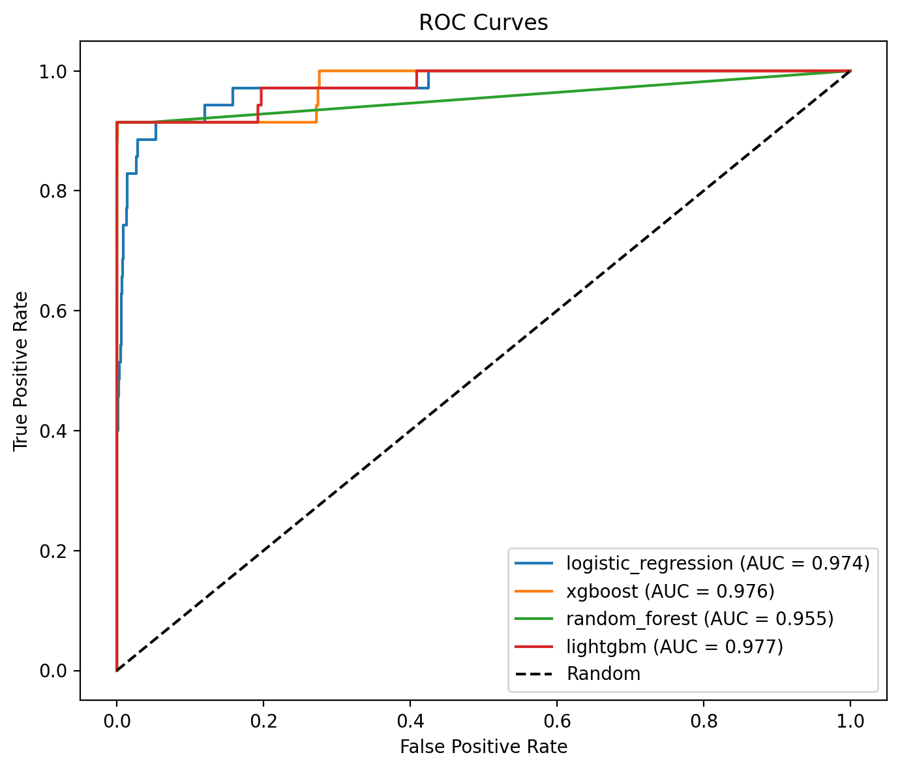

This plot shows:

- ROC curves for each model.
- A diagonal “Random” baseline.
- A legend with model names and their ROC AUC values.

Models that stay closer to the top-left corner and have higher AUC are preferred for ranking transactions by fraud risk.

#### 9.5 Precision-Recall Curves (Evaluation Plot)

The function `plot_precision_recall_curves` creates:

- `evaluation/plots/precision_recall_curves.png`:

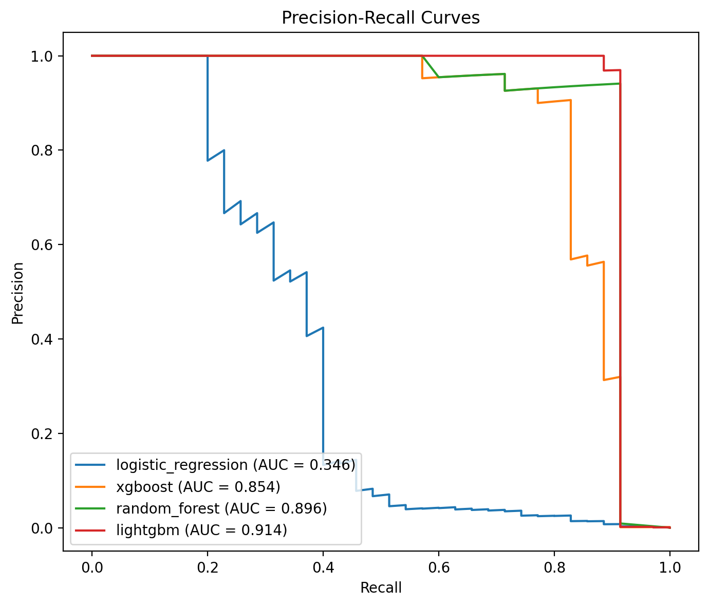

In highly imbalanced settings, Precision-Recall curves are often more informative than ROC curves because they focus directly on performance for the positive (fraud) class. The PR AUC values in the legend capture:

- How much precision can be maintained as recall increases.
- The model’s ability to prioritize truly fraudulent transactions among top-risk candidates.

#### 9.6 Model Comparison Bar Charts (Evaluation Plots)

To facilitate easy comparison across metrics, the script uses `plot_model_comparison_bar` for several metrics:

- `evaluation/plots/model_comparison_accuracy.png`
- `evaluation/plots/model_comparison_precision.png`
- `evaluation/plots/model_comparison_recall.png`
- `evaluation/plots/model_comparison_f1.png`
- `evaluation/plots/model_comparison_roc_auc.png`
- `evaluation/plots/model_comparison_pr_auc.png`

Example plot:

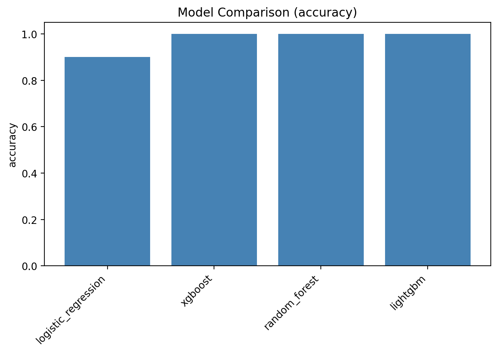

Each bar chart displays metric values for all models, making it straightforward to:

- Rank models by a specific metric.
- Check for consistency across different performance criteria (e.g., a model with slightly lower accuracy but much higher recall may be preferable for fraud detection).

### 10. Model Explainability with SHAP

Model interpretability is essential in high-stakes domains like fraud detection. The evaluation script uses **SHAP (SHapley Additive exPlanations)** to quantify feature contributions to individual predictions.

#### 10.1 Tree-Based Models (XGBoost, Random Forest, LightGBM)

For at least one tree-based model among `["lightgbm", "xgboost", "random_forest"]`, the script:

1. Selects a representative model (preferring LightGBM or XGBoost when available).
2. Samples up to 2,000 instances from `X_test` to form `X_shap`.
3. Instantiates a `shap.TreeExplainer` for the model.
4. Computes SHAP values for the sampled instances.

It then generates:

- **SHAP summary plot**:

  - Saved as `evaluation/plots/shap/{tree_model_name}_shap_summary.png`.

- **SHAP bar plot**:

  - Saved as `evaluation/plots/shap/{tree_model_name}_shap_importance.png`.

These plots illustrate:

- The most impactful features on the model’s output.
- Whether higher or lower feature values are associated with increased fraud risk.
- Overall global feature importance ranking.

#### 10.2 Logistic Regression Explainability

If a logistic regression model is available, the script additionally uses:

- `shap.LinearExplainer` to compute SHAP values tailored for linear models.

The resulting SHAP summary plot is saved as:

- `evaluation/plots/shap/logistic_regression_shap_summary.png`

This provides:

- A more interpretable view of how each feature contributes to the log-odds of fraud.
- A cross-check between the linear model’s view of feature importance and that of tree-based models.

#### 10.3 Benefits for Stakeholders

SHAP-based explainability offers:

- **Transparency** for regulators and auditors.
- **Actionable insights** for fraud analysts (e.g., which behaviors strongly drive fraud risk).
- **Trust** for business owners who must understand how and why the system flags certain transactions.

### 11. Key Findings and Insights

Although precise numerical results depend on the dataset and training runs, the project’s design and evaluation pipeline are set up to yield the following kinds of insights.

#### 11.1 EDA Insights

From the EDA plots (Section 5), typical observations include:

- **Class Imbalance**:
  - The `fraud_distribution` plot confirms that fraudulent transactions form only a small fraction of the dataset.
- **Amount Distributions**:
  - Fraudulent transactions may tend to cluster in certain ranges of `amount`, potentially larger-than-average or concentrated in mid-range values depending on the dataset.
- **Transaction Type Risk**:
  - The `fraud_vs_transaction_type` plot usually shows that certain transaction types (e.g., “TRANSFER”, “CASH_OUT”) have much higher fraud rates than others.
- **Balance Patterns**:
  - Boxplots for `fraud_vs_oldbalanceOrg` and others may reveal that many fraudulent transactions involve suspicious balance changes (e.g., large withdrawals leaving near-zero balances).

These insights help define business rules and refine model features.

#### 11.2 Model Performance

From the evaluation plots (Section 9), common qualitative conclusions might be:

- **ROC and PR Curves**:
  - Tree-based boosting models (e.g., XGBoost, LightGBM) often achieve the highest ROC AUC and PR AUC.
  - Random Forest provides competitive performance with more interpretability and robustness.
  - Logistic Regression, while simpler, still offers a strong baseline and sometimes close performance.
- **Metric Trade-offs**:
  - Some models may achieve higher recall at the cost of lower precision. For fraud detection, this can be acceptable if operationally manageable.
  - A model with slightly lower accuracy but significantly higher recall and PR AUC may be best for production deployment.

The model comparison bar charts quantify these trade-offs across accuracy, precision, recall, F1, ROC AUC, and PR AUC.

#### 11.3 Explainability

SHAP plots typically reveal:

- Engineered features (e.g., balance deltas, suspicious patterns) among the top contributors to fraud predictions.
- Transaction amount, transaction type, and pre-/post-balance features as crucial drivers.
- Consistent feature importance patterns across different models (e.g., LightGBM and XGBoost), which increases trust in the learned patterns.

These explanations help:

- Validate that the model is learning sensible, domain-aligned patterns.
- Identify unexpected drivers, which may suggest new fraud scenarios or data issues.

### 12. How to Reproduce the Results

To reproduce the EDA, training, and evaluation pipeline (and generate all referenced plots), the typical workflow is:

1. **Prepare the environment**
   - Install dependencies (e.g., via `requirements.txt` or your preferred environment manager).
   - Ensure the dataset is available and `utils.data_loader.load_raw_data` is correctly configured.

2. **Run EDA**
   - Execute:
     - `python eda/eda_main.py`
   - This generates all EDA plots under `eda/plots/`, including:
     - `missing_values_heatmap.png`
     - `fraud_distribution.png`
     - `amount_histogram.png`
     - `log_amount_histogram.png`
     - `balance_distributions.png`
     - `fraud_vs_transaction_type.png`
     - `fraud_vs_amount_boxplot.png`
     - `fraud_vs_*_boxplot.png`
     - `correlation_heatmap.png`
     - `outliers_boxplots.png`
     - `kmeans_elbow.png`
     - `kmeans_pca_clusters.png`
     - `feature_relationships_pairplot.png`

3. **Train Models**
   - Execute:
     - `python models/train_models.py`
   - Optionally use `--nrows` for quicker experimentation.
   - This will:
     - Build the preprocessing pipeline.
     - Split into train/val/test sets.
     - Apply SMOTE on the training data.
     - Train Logistic Regression, Random Forest, XGBoost, and LightGBM models.
     - Save trained models and metadata under `models/saved_models/`.

4. **Evaluate Models**
   - Execute:
     - `python evaluation/evaluate_models.py`
   - This will:
     - Load trained models and test data.
     - Compute metrics and save `metrics_table.csv`.
     - Generate confusion matrices for each model.
     - Generate ROC and Precision-Recall curves.
     - Create model comparison bar charts for multiple metrics.
     - Produce SHAP-based explainability plots for one or more models.
   - All evaluation plots are saved under `evaluation/plots/`.

After these steps, all EDA and evaluation plots referenced in this report will be available in the project directory for inspection.

### 13. Limitations and Future Work

While the current pipeline covers a full machine learning lifecycle for fraud detection, there are several limitations and potential extensions:

#### 13.1 Limitations

- **Static Thresholds**:
  - The evaluation uses default classification thresholds (typically 0.5). In production, thresholds should be tuned to optimize business-specific cost functions (e.g., cost of missed fraud vs investigation cost).
- **Single-Dataset Scope**:
  - The models are trained on a single dataset and may not generalize to different regions, products, or time periods without retraining or adaptation.
- **Limited Temporal Modeling**:
  - The current pipeline treats each transaction independently, without explicitly modeling temporal dependencies or customer-level histories (e.g., sequences of transactions).
- **Assumed Stationarity**:
  - The model implicitly assumes that the distribution of fraud patterns remains stable over time; in reality, fraudsters adapt to detection systems.

#### 13.2 Future Improvements

Potential directions for future enhancements include:

- **Threshold and Cost-Sensitive Optimization**:
  - Integrate cost matrices and optimize thresholds or custom loss functions to directly reflect financial impact.
- **Advanced Sampling and Ensemble Techniques**:
  - Experiment with more sophisticated imbalance handling (e.g., SMOTE variants, ensemble methods tuned for rare events).
- **Temporal and Graph-Based Features**:
  - Incorporate time-series features (e.g., transaction velocity, time since last transaction).
  - Use graph-based features (e.g., account network centrality, shared devices or IPs).
- **Online Learning and Drift Detection**:
  - Monitor concept drift and retrain the model periodically or incrementally.
- **Model Governance and Monitoring**:
  - Deploy monitoring dashboards for performance, drift, and fairness metrics over time.

These directions can significantly boost the robustness, adaptability, and business value of the fraud detection system.

### 14. System Design

This chapter describes the overall system design of the fraud detection solution using high-level architecture and workflow diagrams stored in the `diagrams/` folder.

- **End-to-End System Architecture**

  This diagram presents the main building blocks of the system (data source, EDA, feature engineering, preprocessing, model training, evaluation, and deployment/serving), and how data and artifacts (models, metrics, plots) flow between them.

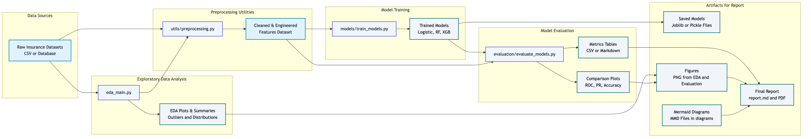

- **Data Pipeline**

  This figure focuses on the data layer: how raw transactional data is ingested, cleaned, enriched with engineered fraud features, and split into train/validation/test sets before being passed to downstream modeling components.

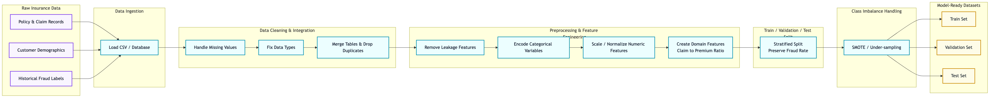

- **Model Training and Comparison Workflow**

  This diagram shows the training workflow for multiple models (Logistic Regression, Random Forest, XGBoost, LightGBM), including preprocessing with the shared pipeline, SMOTE-based balancing, model fitting, and saving artifacts for later comparison.

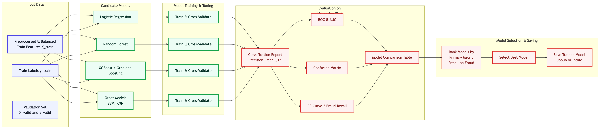

- **Evaluation Workflow**

  This diagram illustrates how saved models are loaded with shared metadata, evaluated on the held-out test set, and how metrics, plots (ROC, PR, confusion matrices, bar charts), and SHAP-based explainability outputs are generated for analysis.

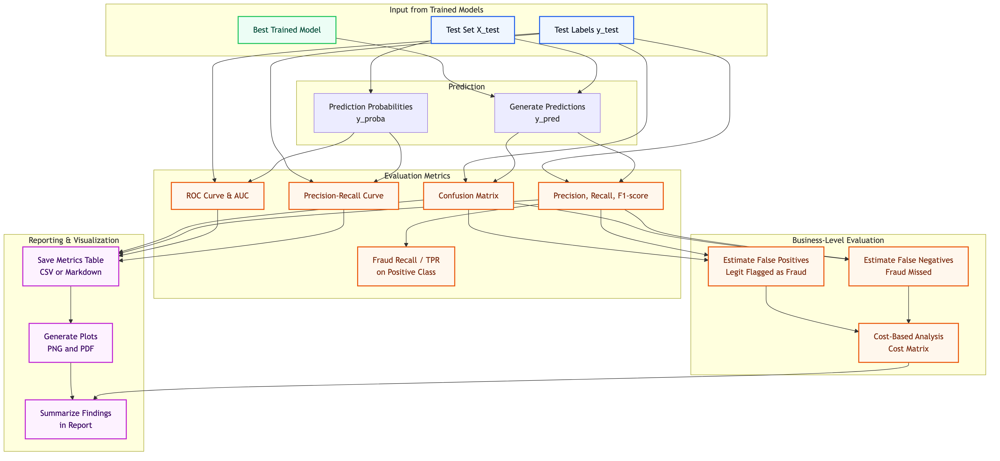

### 15. Conclusion

This project demonstrates an end-to-end **Insurance Fraud Detection** system using modern machine learning practices. Starting from raw transactional data, it:

- Performs comprehensive EDA to understand distributions, correlations, and fraud patterns.
- Applies domain-driven feature engineering and robust preprocessing (including SMOTE for class imbalance).
- Trains a suite of strong baseline and advanced models: Logistic Regression, Random Forest, XGBoost, and LightGBM.
- Evaluates them with a rich set of metrics and visualizations, including ROC and Precision-Recall curves and comparative bar charts.
- Provides model explainability through SHAP values, enabling transparent and trustworthy fraud risk assessment.

The modular code structure and clear workflow make it easy to extend this system—by adding new features, experimenting with additional models, or integrating the best-performing model into a real-time fraud detection pipeline. The linked EDA, evaluation plots, and architecture/workflow diagrams in this report serve as both documentation and analytical tools for understanding and improving the model over time.
